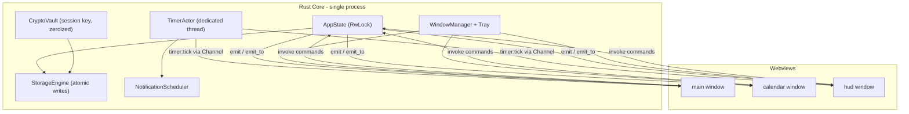

# Study Buddy - System Architecture & Technical Specification

Status: proposed (implementation plan, no code written yet)
Target: standalone native desktop application (Windows primary, macOS/Linux portable)
Stack: Tauri 2 (Rust backend) + React 18 + TypeScript + Vite
Constraints: local-first, zero telemetry, zero cloud, offline-exclusive

This document supersedes the earlier iOS-only (Expo) direction. iPadOS/iOS appears here only
as a responsive layout target (Section 6); shipping to Apple devices requires a Mac and is out
of scope for this phase.

---

## 0. Baseline & Migration Delta

Current repository state (fresh Tauri scaffold):

| File | Current | Required change |
| --- | --- | --- |
| [package.json](../package.json) | `vanilla-ts` template, deps: `@tauri-apps/api`, `@tauri-apps/plugin-opener` | Add React + toolchain (Section 2) |
| [src/main.ts](../src/main.ts) | `greet` demo | Replaced by React entry `src/main.tsx` |
| [tsconfig.json](../tsconfig.json) | strict, no JSX | Add `"jsx": "react-jsx"`, path aliases |
| [vite.config.ts](../vite.config.ts) | bare Tauri config | Add `@vitejs/plugin-react`, multi-entry (single `index.html` + route-based windows) |
| [src-tauri/tauri.conf.json](../src-tauri/tauri.conf.json) | one 800x600 window, `withGlobalTauri: true` | Tri-window config, `withGlobalTauri: false`, strict CSP |
| [src-tauri/capabilities/default.json](../src-tauri/capabilities/default.json) | `windows: ["main"]` | Split into `main`, `calendar`, `hud` capability sets |
| [src-tauri/src/lib.rs](../src-tauri/src/lib.rs) | `greet` command | Replaced by window manager, timer actor, storage, crypto commands |

Rust crates to add: `tauri-plugin-window-state`, `tauri-plugin-notification`,
`tauri-plugin-global-shortcut`, `tauri-plugin-single-instance`, `aes-gcm`, `argon2`, `zeroize`,
`rand`, `parking_lot`, `time`, `thiserror`.

Deliberate omission: no `tauri-plugin-fs` and no `tauri-plugin-http` are exposed to the frontend.
All disk access flows through explicit `#[tauri::command]` functions, and the absence of an HTTP
capability is the structural guarantee of zero telemetry.

---

## 1. System Architecture & Tauri Tri-Window IPC Topology

### 1.1 Process & ownership model

Rust owns all authoritative state. The webviews are subscribers and intent emitters. This is the
single most important rule in the system: no widget writes to disk, and no widget owns timer truth.



### 1.2 Window lifecycle

All three windows load the same bundle and branch on route, so there is one Vite build:

| Label | Route | Builder configuration | Lifecycle |
| --- | --- | --- | --- |
| `main` | `/` | 1280x820, min 960x640, decorated, center on first run | Created at startup; closing it hides to tray, does not exit |
| `calendar` | `/calendar` | 1040x760, decorated, resizable, `skip_taskbar: false` | Lazily created on first open; close destroys the window, state persists |
| `hud` | `/hud` | 360x64, `decorations: false`, `always_on_top: true`, `skip_taskbar: true`, `resizable: false`, `shadow: false` | Lazily created; drag via `data-tauri-drag-region`; close destroys |

Created with `WebviewWindowBuilder::new(app, label, WebviewUrl::App("index.html/#/hud".into()))`
(hash routing avoids per-window HTML entries). The HUD is spawned only from a user action or
`hud.autoShowOnSessionStart` in config.

### 1.3 Window state persistence & multi-monitor safety

`tauri-plugin-window-state` persists size, position, and maximized state per label. Two additions
on top of the plugin, because the plugin alone will happily restore a window onto a monitor that
no longer exists:

1. On startup, `app.available_monitors()` is queried and each restored rect is tested for at least
   64x64 px of intersection with some monitor work area. Failing rects are re-centered on the
   primary monitor.
2. HUD position is snapped to the nearest monitor edge within a 24 px threshold so it re-docks
   predictably after a display change or resolution switch.

Widget layout (grid order, sizes, collapsed state) is not window state and is persisted separately
in `layout/main.json` (Section 4).

Tray behavior: `TrayIconBuilder` with menu items Show Workspace / Toggle HUD / Toggle Calendar /
Start-Pause Focus / Quit. `tauri-plugin-single-instance` focuses the existing `main` window instead
of launching a second process.

### 1.4 IPC topology

Two distinct transports, chosen by frequency:

- **High-frequency stream (timer ticks):** `tauri::ipc::Channel<TimerTick>`. Each window that needs
  ticks registers a channel once via `timer_subscribe`; the actor pushes into live channels only.
  This avoids the broadcast fan-out and JSON round-trip cost of global events at 5 Hz.
- **Discrete state change events:** Tauri events. `emit` for broadcast, `emit_to(label, ...)` for
  targeted delivery.

Event channel catalogue (all payloads in Section 5.9):

| Event | Direction | Targets | Purpose |
| --- | --- | --- | --- |
| `timer:tick` | Rust to UI (Channel) | `main`, `hud` | 200 ms cadence elapsed/remaining |
| `timer:phase` | Rust to UI (broadcast) | all | Phase transition (focus, short break, long break, idle) |
| `tasks:changed` | Rust to UI | all | Task or subtask mutated, with change kind |
| `matrix:changed` | Rust to UI | all | Quadrant membership or ordering changed |
| `matrix:staged-for-calendar` | Rust to UI | `calendar` | Item pushed to the calendar staging rail |
| `calendar:changed` | Rust to UI | all | Time block created, moved, resized, deleted |
| `metrics:changed` | Rust to UI | `main`, `hud` | Streak, daily percent, heatmap cell updated |
| `journal:lock-state` | Rust to UI | all | Vault locked or unlocked, auto-lock countdown |
| `notify:fired` | Rust to UI | focused window | Instructs Sonner to render an in-app toast |
| `window:visibility` | Rust to UI | all | Which windows currently exist and are visible |
| `config:changed` | Rust to UI | all | Leva or settings mutation applied |

Ordering guarantee: every mutation is applied under a single `RwLock` write inside the command,
and the event is emitted after the lock is released but before the command returns. Windows
therefore observe the same order, and a command's return value is always consistent with the
event that follows it.

Latency: same-process `emit_to` plus webview dispatch lands in the tens-of-microseconds to
low-milliseconds range on a warm webview. The design does not depend on a hard sub-millisecond
bound; the HUD is correct even if a tick is late because every tick carries an absolute anchor
rather than an increment (Section 3.1).

---

## 2. Widget Ecosystem & UI Toolchain Integration Matrix

Frontend packages: `react`, `react-dom`, `react-router-dom`, `zustand` (+`immer`),
`@dnd-kit/core`, `@dnd-kit/sortable`, `@dnd-kit/modifiers`, `@number-flow/react`, `cmdk`,
`react-virtuoso`, `sonner`, `leva`, `input-otp`, `liveline`, `motion`.

Two of the nine named tools need a note:

- **originkit.dev** is a pattern source, not a single dependency. It is implemented as a local
  token and primitive layer in `src/ui/kit/` (CSS custom properties for glow/edge/kinetic easing,
  plus `Surface`, `GlowBorder`, `PressableEnergy`, `KineticStack` primitives). Every widget below
  consumes those primitives rather than ad-hoc CSS.
- **Liveline** is consumed behind a thin `ChartSeriesAdapter` interface in `src/ui/charts/`, so the
  live-series implementation is one file wide. Charts push samples through
  `adapter.push(seriesId, sample)` and never touch React state per frame.

| Widget / Feature | Window Host | Input Actions | Emitted IPC Events | UI Libraries Used | Persistence Format |
| --- | --- | --- | --- | --- | --- |
| Focus Engine (stopwatch + Pomodoro) | `main` (+ mirrored in `hud`) | Start, pause, resume, reset, skip phase, adjust interval | `timer_start`, `timer_pause`, `timer_reset`, `timer_skip_phase` to Rust; receives `timer:tick`, `timer:phase` | NumberFlow (mm:ss digits), Liveline (session pacing), Leva (interval tuning), Sonner (phase toasts), originkit (glow ring) | `session.json` (live), `activity/YYYY-MM.json` (completed) |
| Eisenhower Matrix | `main` | Drag between quadrants, reorder within quadrant, quick-convert to time block, archive | `matrix_move_item`, `matrix_reorder`, `matrix_stage_for_calendar`; receives `matrix:changed` | dnd kit (4 droppables + sortable lists), NumberFlow (per-quadrant count badges), Virtuoso (archived items view), originkit (quadrant surfaces) | `matrix.json` |
| Contextual Task Matrix (nested checklist) | `main` | Create, rename, check, indent/outdent, reorder, filter | `task_create`, `task_update`, `task_reorder`, `task_delete`; receives `tasks:changed` | dnd kit (nested sortable), Virtuoso (backlog list), NumberFlow (open/done counts), cmdk (quick add) | `tasks.json` |
| Encrypted Daily Journal | `main` | Unlock with PIN, write Markdown, tag, search, lock | `journal_unlock`, `journal_save`, `journal_lock`, `journal_search`; receives `journal:lock-state` | input-otp (PIN gate), Virtuoso (entry archive), Sonner (save/lock feedback), originkit (locked-state treatment) | `journal/YYYY-MM-DD.md.enc` + `journal/index.json` |
| Ephemeral Venting Corner | `main` | Type freely, burn/dissolve, discard on close | none by design; only local `vent_shred_ack` telemetry-free counter | originkit (dissolve/kinetic burn), motion (particle dissolve), Sonner (confirmation) | none, ever (Section 4.4) |
| Grounding Utilities (box, 4-7-8, 5-4-3-2-1) | `main` | Select protocol, start, advance sensory step | `grounding_log_completion`; receives `metrics:changed` | Liveline (breath waveform guide), NumberFlow (phase seconds), Leva (breath timing tuning), originkit (expanding aura) | `activity/YYYY-MM.json` |
| Activity Heatmap | `main` | Hover cell, switch month/year scope, set daily target | `metrics_set_target`; receives `metrics:changed` | NumberFlow (tooltip scores, streak), Virtuoso (year-scroll of month grids), originkit (cell glow ramp) | `metrics.json` + `activity/YYYY-MM.json` |
| Calendar (Day/Week/Month) | `calendar` | Drag-create block, move, resize, assign task, drag from staging rail | `calendar_create_block`, `calendar_update_block`, `calendar_delete_block`; receives `calendar:changed`, `matrix:staged-for-calendar` | dnd kit (time-grid drag/resize with snap modifiers), Virtuoso (agenda list in Day view), NumberFlow (planned-hours total), Sonner (conflict warnings) | `calendar.json` |
| Consistency HUD | `hud` | Click to focus main, right-click tray menu, drag to reposition | `hud_toggle`, `window_focus_main`; receives `timer:tick`, `metrics:changed` | NumberFlow (countdown, streak, percent), Liveline (micro sparkline), originkit (compact glow bar) | window state via plugin; no domain data |
| Command Palette | all windows | `Ctrl+K` / `Cmd+K`, fuzzy search, execute | dispatches any command above; `window_open`, `window_toggle` | cmdk (palette), originkit (overlay treatment) | recent-command list in `config.json` |
| Tuning Panel | `main` | Adjust Pomodoro intervals, animation velocity, UI scale, HUD opacity, heatmap thresholds | `config_patch`; receives `config:changed` | Leva (folders + bindings), Sonner (applied confirmation) | `config.json` |
| Notification Center | all windows | Toggle rule, set quiet hours | `notify_rule_update`; receives `notify:fired` | Sonner (in-app stack), Tauri notification plugin (OS toast), Leva (rule tuning) | `notifications.json` |

### 2.1 dnd kit: Eisenhower quadrant transitions in detail

The matrix is one `DndContext` containing four `useDroppable` quadrant containers, each wrapping a
`SortableContext` (vertical list strategy). The important mechanics:

1. `collisionDetection: closestCorners` gives predictable behavior at quadrant borders, where
   `closestCenter` tends to snap to the wrong container.
2. `onDragOver` performs an optimistic local move so the card visibly re-parents mid-drag, while
   the authoritative write happens once in `onDragEnd`.
3. `onDragEnd` calls `matrix_move_item({ itemId, fromQuadrant, toQuadrant, toIndex })`. Rust
   validates, persists, and emits `matrix:changed`; the reducer reconciles against the emitted
   snapshot, so a rejected move self-heals instead of leaving a phantom card.
4. Quadrant semantics are applied on entry: moving into `do_first` sets `urgency: high,
   importance: high` and clears any deferral date; moving into `schedule` requires a due date and
   opens the "send to calendar" affordance; `delegate` attaches a delegate note field; `eliminate`
   marks the item archived-on-exit after a 5 s undo window (Sonner action toast).
5. Widget-level drag (rearranging whole widgets on the workspace grid) is a separate outer
   `DndContext` with `restrictToParentElement`; nesting is safe because the inner context stops
   pointer events at the card level.

### 2.2 Cross-window drag limitation and the staging rail

Native OS windows cannot share an HTML5/dnd-kit drag session; a pointer drag cannot leave the
`main` webview and land in `calendar`. Rather than pretend otherwise, the matrix exposes
"Send to calendar", which emits `matrix:staged-for-calendar`. The calendar window renders a
staging rail on its left edge, and the user drags from that rail onto the time grid using a normal
in-window dnd-kit session. Same two-step intent, no illusion of cross-process dragging.

---

## 3. Local Notification & Command Subsystem

### 3.1 Drift-free timing engine

The timer lives in a dedicated Rust thread, never in the webview, because minimized or hidden
webviews are throttled aggressively by WebView2 and WebKit (timers coalesced to 1 s or worse).

Core rule: **ticks never accumulate**. Each tick recomputes from anchors.

```
elapsed_ms = (now_wall - anchor_wall) - accumulated_pause_ms
remaining_ms = phase_duration_ms - elapsed_ms
```

- `anchor_wall: SystemTime` is authoritative for elapsed time and survives suspend.
- `anchor_mono: Instant` is kept alongside it purely to detect wall-clock tampering or a suspend
  event: if `|wall_delta - mono_delta| > 2000 ms`, the tick is flagged
  `discontinuity: Some(DiscontinuityKind)`, the session is marked suspect, and the UI offers
  "keep elapsed" or "trim to last known good".
- Tick cadence is 200 ms via `thread::sleep` against a computed next-deadline, so scheduling jitter
  does not compound. Display updates are driven off the payload, not a local interval.
- Phase completion is evaluated in the same loop, so a phase boundary fires even if every webview
  is hidden.
- Live session state is checkpointed to `session.json` every 5 s and on every transition. On
  restart, an unfinished session is offered for resume with its true elapsed time reconstructed
  from `anchor_wall`.

### 3.2 Dual-layer notification engine

`NotificationScheduler` holds a min-heap of due `ScheduledNotification`s keyed by
`(rule_id, dedupe_key)`, polled by the same 200 ms loop.

Routing decision per fired notification:

| Condition | In-app Sonner | OS toast |
| --- | --- | --- |
| Target window exists and is focused | yes | no |
| Windows exist but unfocused, or app minimized to tray | queued for next focus | yes |
| `rule.severity == critical` (session end, break end) | yes | yes |
| Inside quiet hours and `rule.respectsQuietHours` | queued | suppressed |

OS toasts go through `tauri-plugin-notification` (Windows Toast, macOS UserNotifications,
Linux notify-daemon). Permission is requested once at first use and the denial state is cached in
`notifications.json`, after which the app degrades to Sonner-only without nagging.

Scheduling triggers: focus phase end, break end, long-break due, daily-target check at a
configured hour, streak-at-risk (target unmet with less than 90 minutes left in the day),
idle-during-session (no input for `idleGraceMinutes`), journal auto-lock warning 30 s before lock,
and grounding nudge after N consecutive focus phases without a break.

### 3.3 Command palette (cmdk)

`Ctrl+K` / `Cmd+K` is registered two ways: locally in each webview, and app-wide through
`tauri-plugin-global-shortcut` (`Ctrl+Shift+K`) so the palette can be summoned while Study Buddy
is unfocused - that handler focuses or creates `main` first, then opens the palette.

Command groups: Navigate (jump to widget), Windows (toggle calendar, toggle HUD, show workspace,
minimize to tray), Focus (start, pause, reset, skip phase, start 25/50/90 preset), Tasks (new task,
triage to quadrant, mark done), Matrix (send to calendar, archive quadrant), Journal (unlock, new
entry, lock now), Vent (quick vent, burn), Grounding (box breathing, 4-7-8, 5-4-3-2-1), System
(open tuning panel, export data folder, lock app).

Commands are declared once in a registry (`id`, `label`, `group`, `keywords`, `scope`, `run`,
`enabled`), so the palette, tray menu, and keyboard shortcuts all read from the same source and
cannot drift apart. Palette actions that require an unlocked vault are visible but disabled with a
lock hint rather than hidden.

---

## 4. File-Based Storage, Encryption & Ephemeral Memory Shredding Protocol

### 4.1 Directory tree

Root is `app_config_dir()`: `%APPDATA%\study-buddy\` on Windows,
`~/Library/Application Support/study-buddy/` on macOS, `~/.config/study-buddy/` on Linux.

```
study-buddy/
├── schema.json                 # { schemaVersion, appVersion, createdAt }
├── config.json                 # preferences, Leva-tuned parameters, quiet hours
├── tasks.json                  # TaskItem[] (nested via parentId)
├── matrix.json                 # EisenhowerQuadrantItem[] + per-quadrant ordering
├── calendar.json               # CalendarTimeBlock[]
├── metrics.json                # ConsistencyMetric + daily targets + streak cache
├── notifications.json          # NotificationRule[] + permission state + dedupe log
├── session.json                # live timer checkpoint (deleted on clean stop)
├── layout/
│   ├── main.json               # widget grid order, sizes, collapsed flags
│   └── hud.json                # HUD opacity, docked edge, visible fields
├── activity/
│   ├── 2026-08.json            # ActivityLogRecord[] sharded by month
│   └── 2026-07.json
├── journal/
│   ├── keyring.json            # salt, KDF params, verifier blob, attempt counter
│   ├── index.json              # plaintext metadata only: id, date, tags, title hash
│   └── 2026-08-26.md.enc       # AES-256-GCM sealed Markdown
└── backups/
    └── 2026-08-26T12-00-00/    # rotating snapshot, last 7 kept
```

Note that `journal/index.json` deliberately stores no entry content and no plaintext titles - tags
and dates only - so search-by-tag works while the vault is locked without leaking prose.

### 4.2 Atomic write strategy

Every write is a four-step sequence in `StorageEngine::write_atomic`:

1. Serialize to `Vec<u8>` (`serde_json` pretty for human-inspectable files).
2. Write to `<name>.tmp` in the same directory, then `File::sync_all()`.
3. `fs::rename("<name>.tmp", "<name>")` - atomic on NTFS, APFS, and ext4 within one volume.
4. Best-effort `fsync` on the parent directory (POSIX) to durably record the rename.

Additional rules: writes are debounced 500 ms per file and flushed unconditionally on window blur,
tray minimize, and `ExitRequested`. A single in-process `RwLock` per file plus an advisory
`.lock` file guards against a second instance. On read, a JSON parse failure falls back to the
newest snapshot in `backups/` and surfaces a Sonner error rather than silently starting empty.
`schema.json` drives forward-only migrations, each of which snapshots to `backups/` first.

### 4.3 Cryptographic lifecycle

| Stage | Mechanism |
| --- | --- |
| PIN entry | `input-otp` 6-digit field; the PIN string never leaves the unlock component and is sent to Rust in a single `journal_unlock` invoke |
| Key derivation | Argon2id, m = 64 MiB, t = 3, p = 1, 32-byte output, 16-byte random salt in `keyring.json` |
| Verification | `keyring.json` holds a verifier: AES-256-GCM sealing of the constant `"study-buddy-v1"`; a wrong PIN fails the AEAD tag with no file touched |
| Encryption | AES-256-GCM, fresh 12-byte random nonce per write, AAD binds `entryId` and `schemaVersion` so a sealed file cannot be replayed under a different date |
| Session key | Lives only in `CryptoVault` behind a `Mutex<Option<Zeroizing<[u8; 32]>>>`; never returned to JS, never written to disk |
| Auto-lock | Zeroize on inactivity timeout (default 10 min), manual lock, window close, and app exit |
| Brute force | Attempt counter in `keyring.json` with exponential backoff (2^n seconds, capped at 5 min) persisted across restarts |
| PIN change | Re-derive, re-seal every entry through a temp directory, atomic-rename the directory into place |

Sealed file wrapper (`.md.enc`), little-endian:

```
offset  size  field
0       4     magic "SBJ1"
4       1     version (0x01)
5       1     kdf id (0x01 = Argon2id)
6       2     reserved
8       12    nonce
20      N     ciphertext
20+N    16    GCM tag
```

There is no recovery path by design. Losing the PIN means losing journal entries; the unlock UI
states this before a PIN is first set.

### 4.4 Ephemeral Venting Corner: memory shredding protocol

Rules, in priority order:

1. Vent text never crosses IPC, never reaches Rust, and never touches disk. There is no vent
   command in the Rust API surface at all - the strongest possible guarantee.
2. Text is held in a `Uint8Array` ring buffer (`Vent.buffer`) inside a `useRef`, not in React
   state, so no render snapshot, no time-travel history, and no devtools tree retains it.
3. The `<textarea>` is uncontrolled. Keystrokes append UTF-8 bytes to the buffer; React never sees
   the value.
4. Shred sequence on burn or unmount:
   - overwrite the buffer with `crypto.getRandomValues(buffer)`
   - overwrite again with a second random pass (defeats a single-pass optimizer eliding the write)
   - `buffer.fill(0)`
   - set `textarea.value = ""`, then dispatch `input` so the webview's own undo stack is cleared
   - `bufferRef.current = null` to release the last reference before GC
5. Undo history, clipboard, and IME candidate state are additionally cleared by
   `document.execCommand("delete")` on a full selection before value reset.
6. Autosave, session restore, and crash recovery are explicitly disabled for this widget.

Honest limitation, documented in-product: a JavaScript engine may retain transient copies (string
interning, IME buffers, GPU text atlases) that user-space code cannot reach, and the OS may have
paged them out. The typed-array design minimizes copies and eliminates persistence, but Study Buddy
does not claim forensic-grade erasure. Nothing in the product copy will imply it does.

---

## 5. Complete TypeScript Data Schemas & Rust IPC Event Definitions

### 5.1 Shared primitives

```ts
export type Iso8601 = string;      // "2026-08-26T19:12:04.113Z", always UTC
export type LocalDate = string;    // "2026-08-26", user's local calendar day
export type Uuid = string;
export type Minutes = number;
export type Millis = number;

export type EisenhowerQuadrant = "do_first" | "schedule" | "delegate" | "eliminate";
export type Priority = "critical" | "high" | "normal" | "low";
export type TaskStatus = "open" | "in_progress" | "blocked" | "done" | "archived";
export type WindowLabel = "main" | "calendar" | "hud";
```

### 5.2 `TaskItem`

```ts
export interface TaskItem {
  id: Uuid;
  parentId: Uuid | null;          // nesting; null = root
  order: number;                  // sibling ordering, dnd-kit authoritative
  title: string;
  notes: string | null;           // Markdown
  status: TaskStatus;
  priority: Priority;
  quadrant: EisenhowerQuadrant | null;
  tags: string[];
  estimateMinutes: Minutes | null;
  actualMinutes: Minutes;         // summed from linked activity records
  dueAt: Iso8601 | null;
  deferUntil: Iso8601 | null;
  linkedBlockIds: Uuid[];         // CalendarTimeBlock.id
  checklist: { id: Uuid; label: string; done: boolean }[];
  createdAt: Iso8601;
  updatedAt: Iso8601;
  completedAt: Iso8601 | null;
}
```

### 5.3 `EisenhowerQuadrantItem`

```ts
export interface EisenhowerQuadrantItem {
  id: Uuid;
  taskId: Uuid;                   // projection of a TaskItem
  quadrant: EisenhowerQuadrant;
  order: number;                  // within quadrant
  urgency: "high" | "low";
  importance: "high" | "low";
  delegateTo: string | null;      // only meaningful in "delegate"
  eliminationReason: string | null;
  stagedForCalendar: boolean;
  enteredQuadrantAt: Iso8601;
  quadrantHistory: {
    from: EisenhowerQuadrant | null;
    to: EisenhowerQuadrant;
    at: Iso8601;
  }[];
}

export interface EisenhowerMatrixFile {
  schemaVersion: number;
  items: EisenhowerQuadrantItem[];
  quadrantOrder: Record<EisenhowerQuadrant, Uuid[]>;  // fast reorder without full scan
  archivedItemIds: Uuid[];
}
```

### 5.4 `CalendarTimeBlock`

```ts
export type CalendarView = "day" | "week" | "month";

export interface CalendarTimeBlock {
  id: Uuid;
  title: string;
  taskId: Uuid | null;
  quadrantItemId: Uuid | null;    // provenance when created from the matrix
  startAt: Iso8601;
  endAt: Iso8601;
  allDay: boolean;
  kind: "focus" | "break" | "grounding" | "admin" | "milestone" | "buffer";
  colorToken: string;             // originkit token name, not a raw hex value
  recurrence: {
    frequency: "daily" | "weekly" | "monthly";
    interval: number;
    byWeekday: number[];          // 0 = Sunday
    until: Iso8601 | null;
  } | null;
  linkedSessionIds: Uuid[];
  notes: string | null;
  createdAt: Iso8601;
  updatedAt: Iso8601;
}
```

### 5.5 `ActivityLogRecord`

```ts
export type ActivityKind =
  | "focus_session"
  | "break"
  | "grounding"
  | "journal_entry"
  | "vent_session"        // count and duration only, never content
  | "task_completed";

export interface ActivityLogRecord {
  id: Uuid;
  kind: ActivityKind;
  localDate: LocalDate;           // heatmap bucket key
  startAt: Iso8601;
  endAt: Iso8601;
  durationMs: Millis;
  plannedDurationMs: Millis | null;
  completed: boolean;             // false = abandoned mid-phase
  taskId: Uuid | null;
  blockId: Uuid | null;
  protocol: "pomodoro" | "stopwatch" | "box_breath" | "478_breath" | "54321" | null;
  interruptionCount: number;
  discontinuity: "none" | "system_suspend" | "clock_change";
  createdAt: Iso8601;
}
```

### 5.6 `ConsistencyMetric`

```ts
export interface HeatmapCell {
  localDate: LocalDate;
  focusMs: Millis;
  sessionCount: number;
  targetMs: Millis;
  targetMet: boolean;
  intensity: 0 | 1 | 2 | 3 | 4;   // heatmap ramp bucket
}

export interface ConsistencyMetric {
  schemaVersion: number;
  dailyTargetMinutes: Minutes;
  currentStreakDays: number;
  longestStreakDays: number;
  streakAnchorDate: LocalDate | null;
  todayFocusMs: Millis;
  todayCompletionPercent: number;      // 0-100, NumberFlow source
  rolling7DayAverageMs: Millis;
  rolling28DayAverageMs: Millis;
  focusVelocity: number;               // completed phases per focused hour
  heatmap: HeatmapCell[];
  lastRecalculatedAt: Iso8601;
}
```

### 5.7 `JournalDocument`

```ts
export interface JournalIndexEntry {          // plaintext, safe while locked
  id: Uuid;
  localDate: LocalDate;
  tags: string[];
  wordCount: number;
  fileName: string;                            // "2026-08-26.md.enc"
  nonceHex: string;
  createdAt: Iso8601;
  updatedAt: Iso8601;
}

export interface JournalDocument {             // exists only while unlocked, in memory
  id: Uuid;
  localDate: LocalDate;
  title: string;
  bodyMarkdown: string;
  tags: string[];
  mood: 1 | 2 | 3 | 4 | 5 | null;
  linkedTaskIds: Uuid[];
  createdAt: Iso8601;
  updatedAt: Iso8601;
}

export interface VaultState {
  initialized: boolean;
  locked: boolean;
  autoLockAtMs: Millis | null;
  failedAttempts: number;
  lockoutUntil: Iso8601 | null;
}
```

### 5.8 `NotificationRule`

```ts
export type NotificationTrigger =
  | "focus_phase_end"
  | "break_end"
  | "long_break_due"
  | "daily_target_check"
  | "streak_at_risk"
  | "idle_during_session"
  | "journal_autolock_warning"
  | "grounding_nudge";

export interface NotificationRule {
  id: Uuid;
  trigger: NotificationTrigger;
  enabled: boolean;
  severity: "info" | "important" | "critical";
  channels: { inApp: boolean; osToast: boolean };
  titleTemplate: string;
  bodyTemplate: string;
  leadTimeMs: Millis;                 // fire before the event
  cooldownMs: Millis;                 // dedupe window
  respectsQuietHours: boolean;
  soundEnabled: boolean;
}

export interface NotificationsFile {
  schemaVersion: number;
  rules: NotificationRule[];
  quietHours: { enabled: boolean; startLocal: string; endLocal: string };  // "22:30"
  osPermission: "unknown" | "granted" | "denied";
}
```

### 5.9 `IPCEventPayloads`

```ts
export type TimerPhase = "idle" | "focus" | "short_break" | "long_break" | "stopwatch";
export type TimerRunState = "idle" | "running" | "paused" | "completed";

export interface TimerTickPayload {
  sessionId: Uuid;
  phase: TimerPhase;
  runState: TimerRunState;
  anchorAt: Iso8601;                  // absolute, so a late tick is still correct
  elapsedMs: Millis;
  remainingMs: Millis | null;         // null for stopwatch
  phaseDurationMs: Millis | null;
  phaseIndex: number;                 // position in the Pomodoro cycle
  cycleLength: number;
  discontinuity: "none" | "system_suspend" | "clock_change";
}

export interface IPCEventPayloads {
  "timer:tick": TimerTickPayload;
  "timer:phase": {
    sessionId: Uuid;
    from: TimerPhase;
    to: TimerPhase;
    at: Iso8601;
    autoStarted: boolean;
  };
  "tasks:changed": {
    kind: "created" | "updated" | "deleted" | "reordered";
    taskIds: Uuid[];
    revision: number;
  };
  "matrix:changed": {
    kind: "moved" | "reordered" | "archived" | "restored";
    itemIds: Uuid[];
    quadrantCounts: Record<EisenhowerQuadrant, number>;
    revision: number;
  };
  "matrix:staged-for-calendar": {
    quadrantItemId: Uuid;
    taskId: Uuid;
    title: string;
    suggestedDurationMinutes: Minutes;
  };
  "calendar:changed": {
    kind: "created" | "updated" | "deleted";
    blockIds: Uuid[];
    conflicts: { blockId: Uuid; withBlockId: Uuid }[];
    revision: number;
  };
  "metrics:changed": Pick<
    ConsistencyMetric,
    "currentStreakDays" | "todayFocusMs" | "todayCompletionPercent" | "focusVelocity"
  > & { changedDates: LocalDate[] };
  "journal:lock-state": VaultState;
  "notify:fired": {
    ruleId: Uuid;
    trigger: NotificationTrigger;
    title: string;
    body: string;
    severity: "info" | "important" | "critical";
    renderedInApp: boolean;
    renderedAsOsToast: boolean;
    at: Iso8601;
  };
  "window:visibility": {
    windows: { label: WindowLabel; exists: boolean; visible: boolean; focused: boolean }[];
  };
  "config:changed": { patchedKeys: string[]; revision: number };
}
```

### 5.10 Rust event payload structs

```rust
use serde::{Deserialize, Serialize};

#[derive(Debug, Clone, Serialize, Deserialize)]
#[serde(rename_all = "snake_case")]
pub enum TimerPhase { Idle, Focus, ShortBreak, LongBreak, Stopwatch }

#[derive(Debug, Clone, Copy, Serialize, Deserialize)]
#[serde(rename_all = "snake_case")]
pub enum Discontinuity { None, SystemSuspend, ClockChange }

#[derive(Debug, Clone, Serialize)]
#[serde(rename_all = "camelCase")]
pub struct TimerTickPayload {
    pub session_id: String,
    pub phase: TimerPhase,
    pub run_state: TimerRunState,
    pub anchor_at: String,
    pub elapsed_ms: u64,
    pub remaining_ms: Option<u64>,
    pub phase_duration_ms: Option<u64>,
    pub phase_index: u32,
    pub cycle_length: u32,
    pub discontinuity: Discontinuity,
}

#[derive(Debug, Clone, Serialize)]
#[serde(rename_all = "camelCase")]
pub struct MatrixChangedPayload {
    pub kind: MatrixChangeKind,
    pub item_ids: Vec<String>,
    pub quadrant_counts: std::collections::HashMap<String, usize>,
    pub revision: u64,
}

#[derive(Debug, Clone, Serialize)]
#[serde(rename_all = "camelCase")]
pub struct VaultStatePayload {
    pub initialized: bool,
    pub locked: bool,
    pub auto_lock_at_ms: Option<u64>,
    pub failed_attempts: u32,
    pub lockout_until: Option<String>,
}
```

All Rust payload structs use `#[serde(rename_all = "camelCase")]` so the TypeScript interfaces
above are the literal wire format. A `cargo test` snapshot test asserts the serialized JSON keys,
which is what actually keeps the two layers honest over time.

### 5.11 File schema definition (`schema.json`)

```json
{
  "schemaVersion": 1,
  "appVersion": "0.1.0",
  "createdAt": "2026-08-26T19:00:00.000Z",
  "files": {
    "tasks.json": { "schemaVersion": 1, "root": "TaskItem[]" },
    "matrix.json": { "schemaVersion": 1, "root": "EisenhowerMatrixFile" },
    "calendar.json": { "schemaVersion": 1, "root": "CalendarTimeBlock[]" },
    "metrics.json": { "schemaVersion": 1, "root": "ConsistencyMetric" },
    "notifications.json": { "schemaVersion": 1, "root": "NotificationsFile" },
    "activity/*.json": { "schemaVersion": 1, "root": "ActivityLogRecord[]" },
    "journal/index.json": { "schemaVersion": 1, "root": "JournalIndexEntry[]" },
    "journal/*.md.enc": { "schemaVersion": 1, "wrapper": "SBJ1", "cipher": "AES-256-GCM" }
  }
}
```

---

## 6. Desktop Multi-Window UI/UX Wireframes & Responsive Layouts

### 6.1 Tri-window desktop arrangement (dual monitor)

```
 MONITOR 1 (primary)                              MONITOR 2
+-------------------------------------------+   +---------------------------+
| Study Buddy - Workspace          [_][#][X]|   | Calendar (detached) [_][X]|
|  Ctrl+K  Focus 24:31  Streak 12  78%      |   |  [Day][Week][Month]  Aug  |
+-------------------------------------------+   +---------------------------+
|                                           |   | STAGING | Mon Tue Wed Thu |
|  FOCUS ENGINE            EISENHOWER       |   | RAIL    |                 |
|  +---------------------+ +--------------+ |   | +-----+ | 09 [Deep Work ] |
|  |     ( 24:31 )       | | see 6.2      | |   | |Essay| | 10 [Deep Work ] |
|  |   NumberFlow ring   | |              | |   | |CS hw| | 11 [   break  ] |
|  |  [start][pause][>|] | |              | |   | +-----+ | 12 [ Lunch    ] |
|  +---------------------+ +--------------+ |   |         | 13 [Essay     ] |
|                                           |   |         | 14 [Grounding ] |
|  TASK MATRIX             JOURNAL (locked) |   |         | 15 [Review    ] |
|  +---------------------+ +--------------+ |   +---------------------------+
|  | [x] Read ch. 4      | |   [_][_][_]  | |
|  |  |- [ ] notes       | |   [_][_][_]  | |    +---------------------+
|  | [ ] Problem set     | |  input-otp   | |    | HUD (always-on-top) |
|  |  Virtuoso scroll    | |  Unlock      | |    | 24:31 | 12d | 78% ~ |
|  +---------------------+ +--------------+ |    +---------------------+
|                                           |     borderless, draggable,
|  HEATMAP                 GROUNDING / VENT |     click focuses workspace
|  +---------------------+ +--------------+ |
|  | # # # # # # #  Aug  | | Box  4-7-8   | |
|  | # # # # # # #       | | (  breathe ) | |
|  | # # # # # # #  12d  | | [ vent... ]  | |
|  +---------------------+ +--------------+ |
+-------------------------------------------+
```

### 6.2 Eisenhower Matrix widget (dnd kit quadrants)

```
+-----------------------------------------------------------------------+
| EISENHOWER MATRIX                        [archive] [expand] [tune]    |
+-----------------------------+-----------------------------------------+
|         URGENT              |            NOT URGENT                   |
+-----------------------------+-----------------------------------------+
| DO FIRST              (3)   | SCHEDULE                        (5)     |
| +-------------------------+ | +-------------------------------------+ |
| | :: Lab report  due 21h  | | | :: Essay outline    -> calendar     | |
| | :: Fix build            | | | :: Read ch. 7       Sep 02          | |
| | :: Reply advisor        | | | :: Gym plan                         | |
| +-------------------------+ | +-------------------------------------+ |
|   drop target (closest-     |   requires dueAt on entry;             |
|   corners collision)        |   shows "send to calendar" affordance   |
+-----------------------------+-----------------------------------------+
| DELEGATE              (1)   | ELIMINATE                       (2)     |
| +-------------------------+ | +-------------------------------------+ |
| | :: Slides -> teammate   | | | :: Doomscroll                       | |
| +-------------------------+ | | :: Re-org notes app                 | |
|   delegateTo field appears  | +-------------------------------------+ |
|                             |   5s undo toast before archive          |
+-----------------------------+-----------------------------------------+
  ":: " = dnd-kit drag handle;  counts render through NumberFlow
```

### 6.3 Single-monitor fallback (calendar docked, HUD parked)

```
+-----------------------------------------------------------+
| Workspace                    | Calendar (right-snapped)   |
| focus + matrix + tasks       | week grid, narrow columns   |
| widgets reflow to 1 column   | staging rail collapses to   |
| below 1100 px                | an icon strip               |
+-----------------------------------------------------------+
| HUD parks bottom-right, 360x64, opacity 0.85 until hover   |
+-----------------------------------------------------------+
```

### 6.4 iPadOS / iOS responsive adaptation (design only in this phase)

There are no OS windows on iPad, so the tri-window model collapses into one canvas. The same React
routes are reused; only the shell changes.

```
iPad landscape (Stage-style split)         iPhone portrait (stacked)
+--------------------------------------+   +---------------------+
| Study Buddy            24:31  12d    |   |  24:31   12d   78%  |
+------------------+-------------------+   +---------------------+
| WORKSPACE        | CALENDAR          |   |  FOCUS RING         |
| (primary pane)   | (secondary pane)  |   |   ( 24:31 )         |
|                  |                   |   |  [start] [pause]    |
| focus ring       | 09 [Deep Work  ]  |   +---------------------+
| matrix 2x2 ->    | 10 [Deep Work  ]  |   |  MATRIX (1 quadrant |
|   swipeable      | 11 [ break     ]  |   |  at a time, tabbed) |
|   quadrant tabs  | 12 [ Lunch     ]  |   |  [DO][SCH][DEL][ELI]|
| tasks (Virtuoso) | 13 [Essay      ]  |   +---------------------+
|                  |                   |   |  TASKS (Virtuoso)   |
+------------------+-------------------+   +---------------------+
| HUD becomes a persistent top bar     |   | tab bar:            |
| (no always-on-top concept on iOS)    |   | Focus Plan Log You  |
+--------------------------------------+   +---------------------+
```

Adaptation rules: HUD becomes an inline status bar; the calendar becomes a routed pane instead of a
window; `cmdk` is reachable from a search affordance rather than `Ctrl+K`; dnd-kit switches to
`TouchSensor` with a 200 ms activation delay so scrolling still works; Leva's tuning panel becomes a
standard settings form; OS toasts require an Apple notification entitlement. Building this target
needs a Mac and an Apple Developer account, so it stays specification-only for now.

---

## 7. Implementation Phases

| Phase | Scope | Exit criteria |
| --- | --- | --- |
| 1 | React migration: `@vitejs/plugin-react`, JSX tsconfig, hash router, `src/ui/kit/` originkit token layer, strict CSP, `withGlobalTauri: false` | Three routes render; `npm run tauri dev` clean |
| 2 | Rust core: `AppState`, `StorageEngine` (atomic write, migrations, backups), typed commands, error taxonomy | Round-trip tests for every JSON file; crash-during-write test leaves prior file intact |
| 3 | Window manager: tri-window builders, per-window capabilities, `window-state` plugin, monitor validation, tray, single-instance | HUD stays on top, positions survive restart and monitor unplug |
| 4 | Timer actor + Channel IPC + HUD live readout, `session.json` checkpointing | 60-minute drift test under 250 ms; correct elapsed after sleep/resume; correct while minimized |
| 5 | Main-window widgets: focus engine, task matrix, Eisenhower quadrants (dnd kit), heatmap, grounding | Cross-quadrant drag persists and reconciles; heatmap matches activity shards |
| 6 | Calendar window: Day/Week/Month, drag-create/move/resize, staging rail, conflict detection | Block edits sync to `main` under 1 frame; conflicts surface in Sonner |
| 7 | Journal vault: Argon2id + AES-256-GCM, `input-otp` gate, auto-lock, PIN change; Venting Corner shredder | Wrong-PIN backoff works across restart; no vent string reachable from any Rust command |
| 8 | Notification scheduler, `cmdk` command registry, Leva tuning panel wired to `config.json` | Toast routing table honored; every palette command has a tray or shortcut path |
| 9 | Hardening: Virtuoso on all long lists, `cargo test` payload snapshots, Vitest reducers, MSI/NSIS bundle, data-folder export | Cold start under 1.5 s; 10k-task backlog scrolls at 60 fps |

Deferred by design: cloud sync, telemetry, multi-user accounts, mobile builds, desktop app-blocking
(sandbox-hostile on modern OSes and out of scope here).
